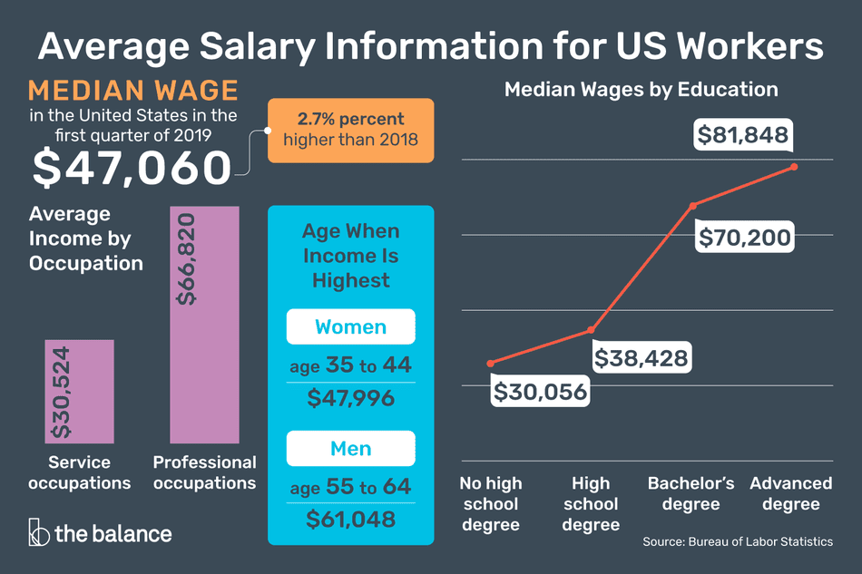

# Salary_Prediction_Project
Artificial Intelligence project on the prediction of salaries of workers based on some information about their profile 

Major Project to predict the salaries of workers in diffrent fields of work. 

# File Guide

Salary Prediction Model.ipynb : Where the data was preprocessed and the model created.

Test_features.csv : The test data.

Train_features.csv: The train data.

Train_salaries : The train salaries data.

# Problem Definition

Examine a set of job details to relevant credentials and make salary prediction. The goal is to predict The salary of a job posting based on the given information.

# Exploratory Analysis

Summerise the data in a meaningful way. 

Identify pattern and outliers. 

Examine the distribution of the variables. 

This project is highly tunned by the parameters to get the Mean Squared Error below 360.

important features which helped in the predicting of the model was outlined.

# Insights 

Insights shows that ones qualification playes a major role in determining salaries of the worker...
